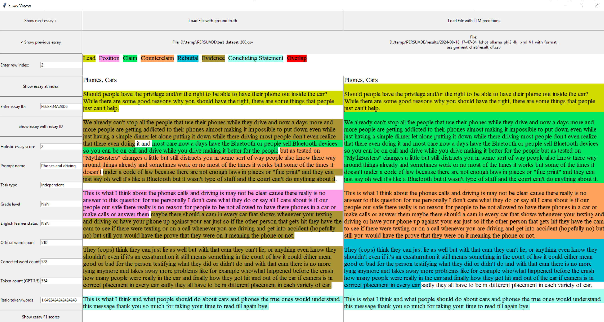

# Argument Mining with Generative LLMs

This repository contains the source code used to evaluate the performance of generative LLMs in the task of argument mining, similar to the Kaggle competition ['Feedback Prize - Evaluating Student Writing'](https://www.kaggle.com/competitions/feedback-prize-2021). The latest version of the [PERSUADE corpus by Crossley et al.](https://github.com/scrosseye/persuade_corpus_2.0) is utilized as the dataset.

## Preparation

1. **Set Up Python Environment**:
   - Create a Python environment using `requirements.txt`.
   
2. **Download Dataset**:
   - Download the PERSUADE dataset from [PERSUADE Corpus 2.0](https://github.com/scrosseye/persuade_corpus_2.0).

3. **Configure Paths**:
   - Customize the paths and file names in [`config.py`](config.py) to point to the location of the downloaded dataframes.

4. **Data Preparation**:

> [!NOTE]
> The cleaning script was initially developed using the files `persuade_corpus_1.0.csv` and `persuade_2.0_human_scores_demo_id_github`, which were the only files available at that time. Since `persuade_corpus_1.0.csv` is no longer available, the original script has been adapted to work with the new `persuade_corpus_2.0.csv` file. However, please note that as this file might be subject to future changes, the script may need further adaptation to ensure compatibility.

   - Run [`load_and_clean_dataset_persuade2.py`](dataset/cleaning_selection/load_and_clean_dataset_persuade2.py) to:
     - Recalculate word counts.
	 - Calculate token counts.
     - Clean essay texts and discourse unit texts (e.g., remove excess non-breaking spaces `\xa0`), creating a `full_text_clean` column that will be used in the experiments.
     - Recalculate the discourse unit start and end indices, generating `discourse_start_clean` and `discourse_end_clean` columns, which are also utilized in the experiments.
	 
   - Run [`create_test_dataset_splits.py`](dataset/cleaning_selection/create_test_dataset_splits.py) to:
     - Create dataframes for the test dataset split and the few-shot examples.

5. **RAG Experiment Setup**:
   - For the Retrieval Augmented Generation (RAG) experiment, create the Chroma database using [`create_essay_embeddings.py`](dataset/create_essay_embeddings.py).

6. **Configure LLMs**:
   - For local inference:
     - Install Ollama and the respective models.
     - Install LM-Studio and download the necessary models.
   
   - For API-based inference:
     - Create an account with a service like Mistral or OpenAI, generate an API key, and save it as an environment variable (`MISTRAL_API_KEY` or `OPENAI_API_KEY`).
     - If needed, create additional model scripts similar to those in the [`models`](/models) directory.

## Experiment Execution

To start an experiment, you can use the template located in the [`start_experiment_template.py`](scripts/start_experiment_template.py). To run only one experiment, exactly one `example_df_file`, `model_module`, `prompt_module`, and `prompt_format` must be uncommented. If multiple lines are uncommented for any input parameter, then all possible combinations are run.

### Parameters

- **`model_abbrev : string`**  
  The model name. Used as part of the experiment identifier.

- **`output_dir : string`**  
  The directory for logs and result dataframes.

- **`df_file : string`**  
  Path to the CSV file containing all discourse units and essay information. This dataframe includes the essays to be classified and the ground truth discourse units for calculating the result metrics.

- **`model_module : module`**  
  Module containing the `get_llm()` method that returns the model.

- **`prompt_module : module`**  
  Module containing `prompt_dict`, which is used to build the prompt template.

- **`create_batch_only : boolean`**  
  If `True`, the model is not invoked directly. Instead, a batch file is created and written to the output directory for use with the OpenAI Batch API.

- **`batch_result_file : string`**  
  Path to the batch result file created by OpenAI's batch API. This triggers the evaluation of the batch file instead of invoking the LLM directly.

- **`numOfEssaysPerBatchFile : int`**  
  If specified, the batch file is split into multiple files, each containing a specified number of essays to avoid size restrictions imposed by OpenAI.

- **`prompt_format : string`**  
  - `"simple"`: The prompt consists of a single user (human) message.
  - `"chat"`: The system role is used for the preamble, user (human) messages for the essays to be classified, and assistant (AI) messages to show example essays.

- **`parser : function`**  
  The parser function from [`utils.py`](utils.py) according to the prompt template format.

- **`example_df_file : string or int`**  
  Path to the CSV file containing discourse units and essay information for the examples provided to the model. If an integer is given, the retriever returns the specified number of similar essays as examples.

- **`fuzzysearch_factor : int, optional`**  
  Defines how many characters are allowed per correction operation (`fuzzysearch max_l_dist = character count of discourse unit / fuzzysearch_factor`). A lower value allows more differences but increases runtime. The default is `7`.

- **`slice_start : int, optional`**  
  Start index of the slice of essays for tests with fewer essays (use `None` for the entire dataframe). The default is `None`.

- **`slice_end : int, optional`**  
  End index of the slice of essays for tests with fewer essays (use `None` for the entire dataframe). The default is `None`.

- **`temperature : int, optional`**  
  Temperature parameter for the LLM. The default is `0`.

- **`max_tokens : int, optional`**  
  Maximum number of tokens the LLM should generate. The default is `3000`.

### Result Logs

Logs and result dataframes are written to the `OUTPUT_DIR` defined in [`config.py`](config.py). The `result_df.csv` can be used to compare the LLM's results to the ground truth dataframe with the essay visualizer (see below). `prompts.log` contains the assembled prompts along with the LLM outputs for each essay in the test dataset. `metrics_df.csv` includes the F1 scores, which are also written to the global `results_overview.xlsx`.

### Batch File Creation and Evaluation

OpenAI offers a 50 % discount on model prices when using the batch API. To create a batch file instead of directly invoking the LLM, set the `create_batch_only` parameter in [`start_experiment_template.py`](scripts/start_experiment_template.py) to `True`. The batch file is then written to the `OUTPUT_DIR` defined in [`config.py`](config.py). This file must be manually uploaded on OpenAI's website. After downloading the result file, enter its path in the `batch_result_file` parameter in [`start_experiment_template.py`](scripts/start_experiment_template.py). This, together with `create_batch_only` set to `True`, will trigger the evaluation of the output file.

## Essay Visualizer

To visualize ground truth discourse units and predicted discourse units of essays side-by-side, run [`dataset/essay_visualizer.py`](dataset/essay_visualizer.py) and select the respective dataframes. The ground truth dataframe must be created with [`load_and_clean_dataset_persuade2.py`](dataset/cleaning_selection/load_and_clean_dataset_persuade2.py) or be a split of the dataset created with this script to ensure that it contains all the necessary columns.

